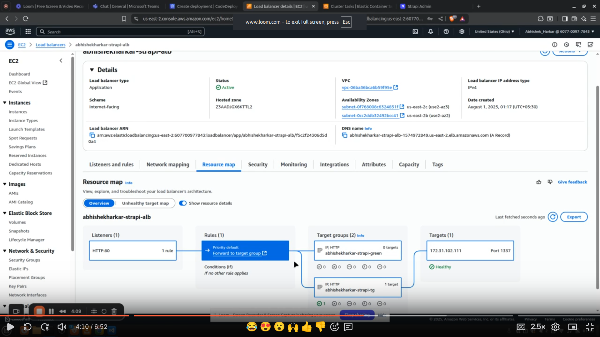
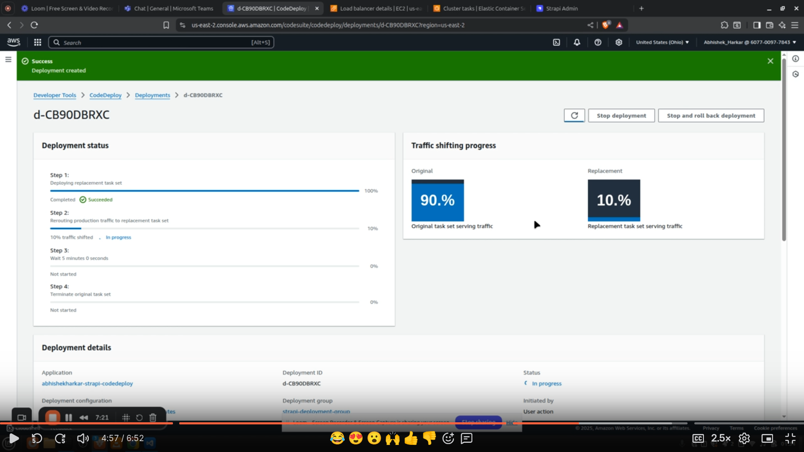
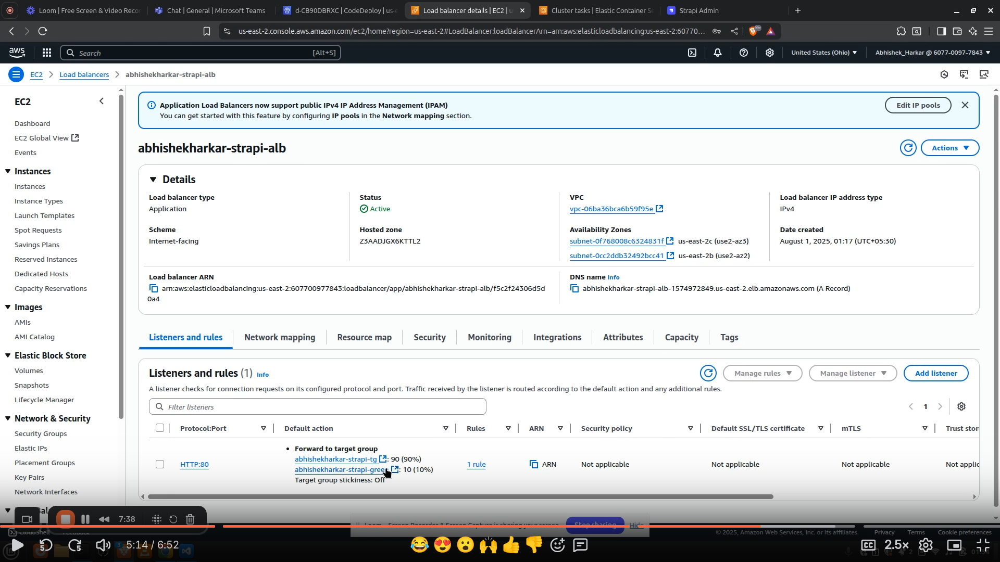
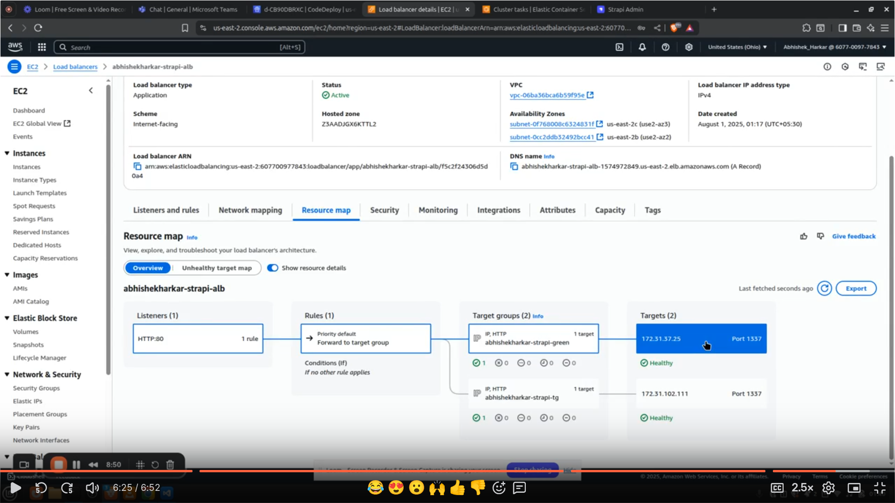
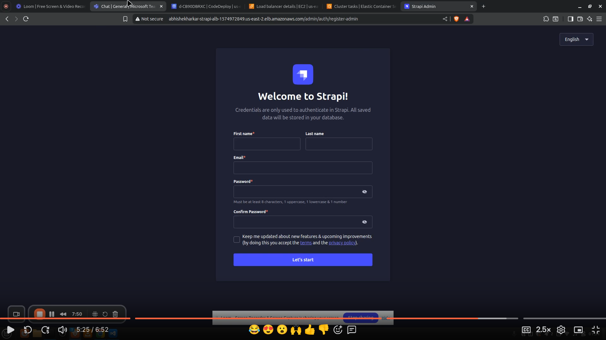

# Task 11

Configure AWS resources for Blue/Green deployment of the Strapi app:

1) Create an ECS cluster and service with Fargate launch type.
2) Set up an Application Load Balancer (ALB) with two Target Groups (Blue and Green) for traffic routing.
3) Configure ALB security group to allow HTTP (port 80) and HTTPS (port 443) traffic.
4) Define an ECS Task Definition as a placeholder, to be updated dynamically.
5) Create an AWS CodeDeploy Application and Deployment Group for ECS with the following settings:
6) Deployment strategy: CodeDeployDefault.ECSCanary10Percent5Minutes (or AllAtOnce if preferred).
7) Enable automatic rollback on deployment failure.
Terminate old tasks after successful deployment.
8) Set up an ECS security group to allow traffic from the ALB on port 1337.
Configure the ALB Listener to switch traffic between Blue and Green Target Groups.
 

## Steps
### 1. Update main.tf

a) Create 2 target group (blue and green)

b) Create codeDeploy application and iam role with policy 'AWSCodeDeployRoleForECS'

c) Create Deployment group: 
     (1) BLUE_GREEN deployment style with WITH_TRAFFIC_CONTROL
     (2) config with termination after 5 minutes and ready option block
     (3) attach ECS service and cluster
     (4) load balancer info like blue tg , green tg and arn of ALB listener
     (5) auto rollback configuration on failure of deployment
     (6) deployment config name will be 'CodeDeployDefault.ECSCanary10Percent5Minutes'
     
### 2. Run Terraform 

     terraform init
     terraform apply

## Results 

### Before Blue-Green deployment:

### After 10% traffic shift: 

### After 100% traffic shift: 

### Strapi Admin Panel on ALB Dns Name:  

