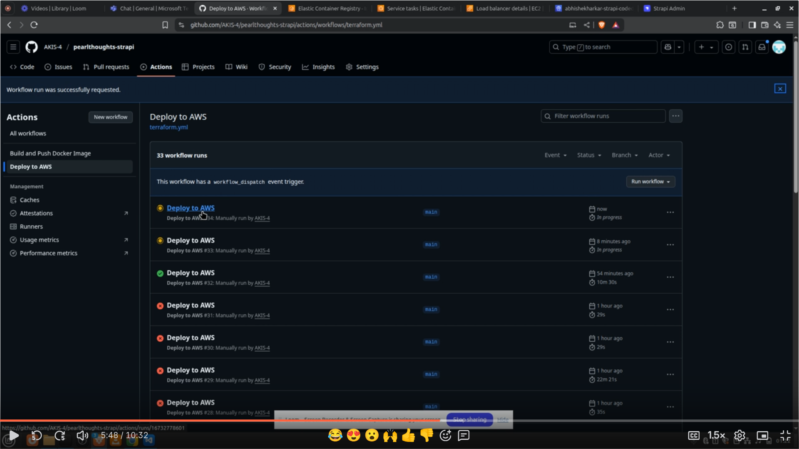
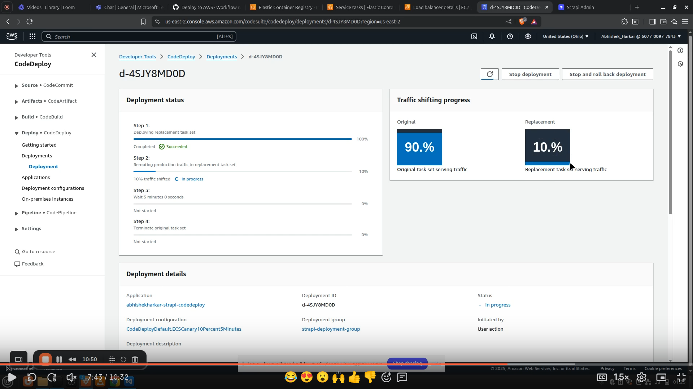
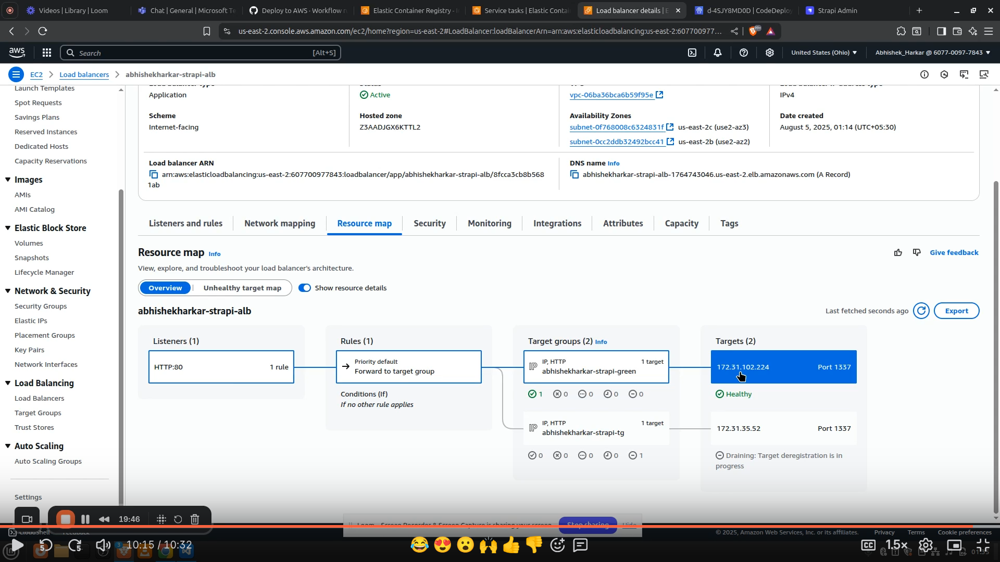
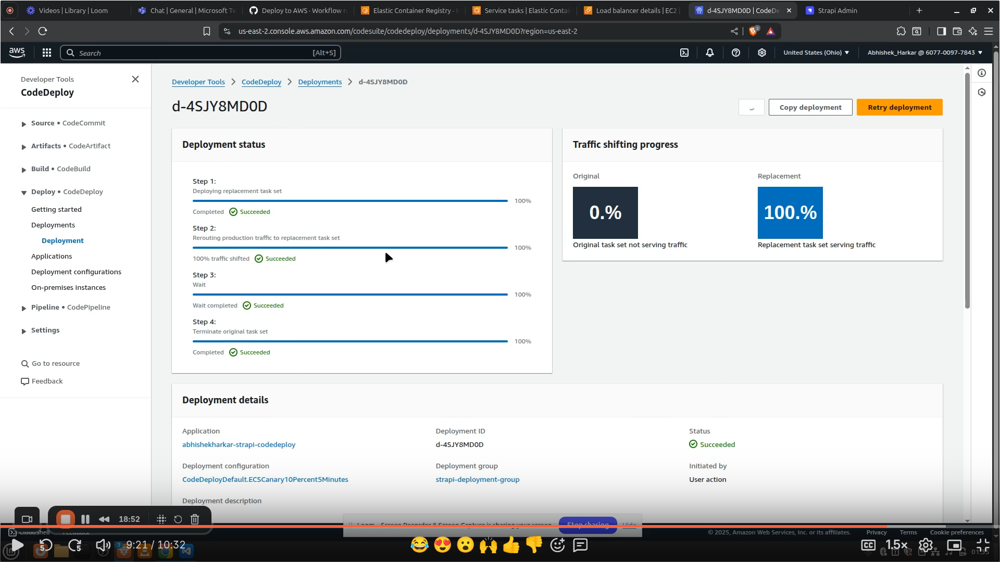
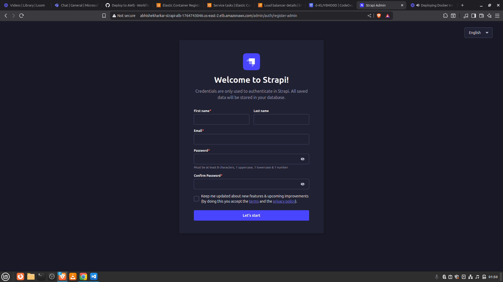

# Task 12

Set up a GitHub Actions workflow to handle deployment:

1) Push the pre-built Docker image to Amazon ECR, tagged with the GitHub commit SHA.
2) Update the ECS Task Definition with the new image tag dynamically.
3) Trigger an AWS CodeDeploy deployment to roll out the updated ECS service.
4) Optionally, monitor deployment status and initiate rollback if the deployment fails.

## Steps
### 1. Update terraform.yml

Change the ELSE logic in terraform apply step to create new task revision and new deployment instead of updating ecs service directly 

     
### 2. Change appspec.yaml to appspec.json

For simplicity and yaml gives indentation and \n issues 

### 3. Run terraform.yml workflow 2 times 
 a) First time it will create resources and deploy strapi on blue tg 

 b) Second time it will deploy new image on green tg 

## Results 

### terraform.yml workflow ran 2 times:  

### After 10% traffic shift: 

### After 100% traffic shift: 

### Before and After Blue-Green deployment:

