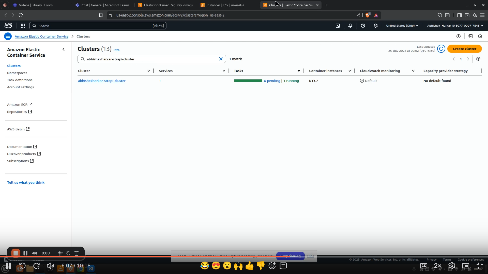
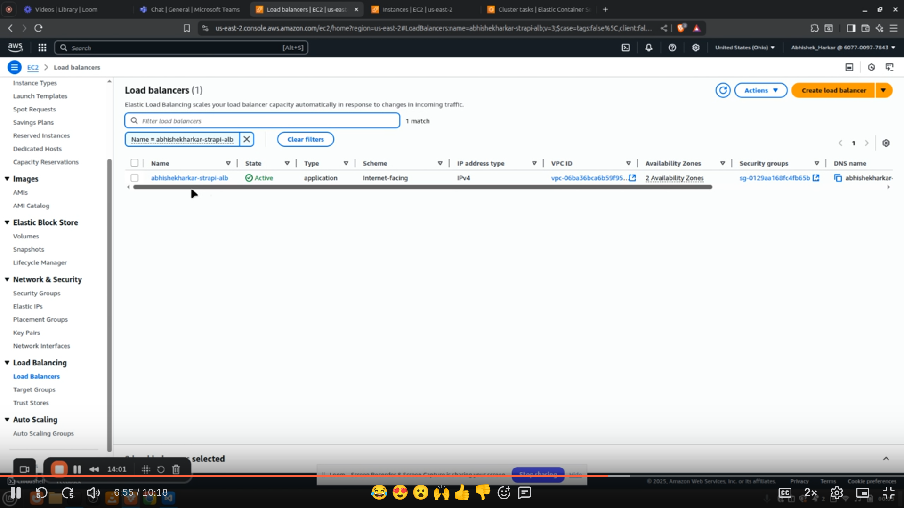
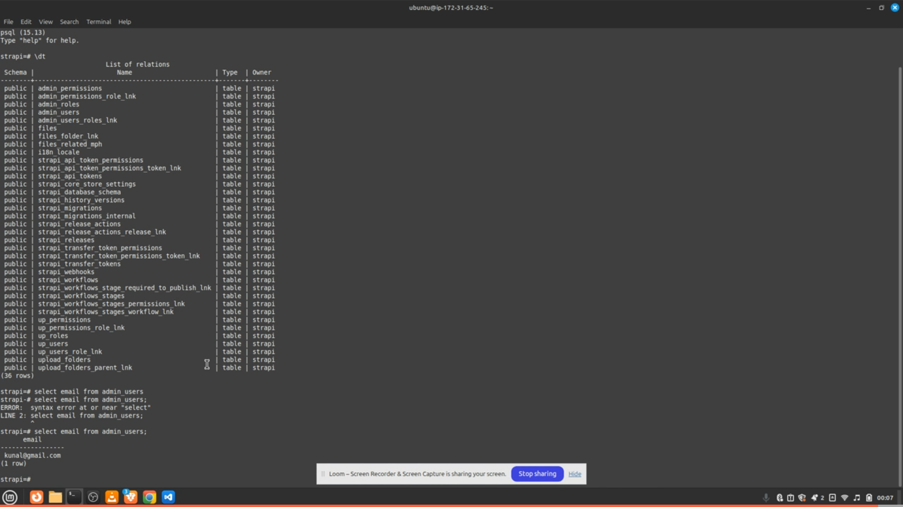
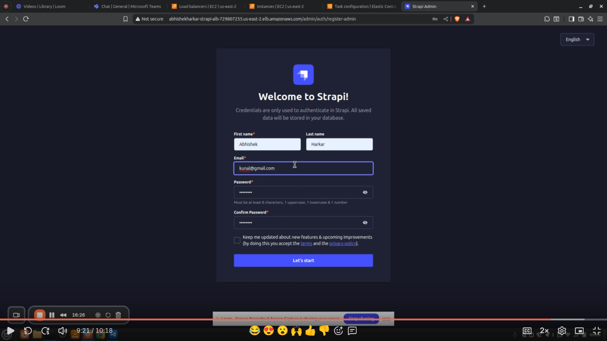

# Task 6

Deploy a Strapi application on AWS using ECS Fargate, managed entirely via Terraform

1) Containerize the Strapi app using Docker.

2) Push the image to  ECR.

3) Write Terraform code to:

    a) Use default VPC

    b) Create ECS Cluster 

    c) Define ECS Task Definition (using Docker image)

    d) Create ECS Service (Fargate launch type)

    e) Create Security Group and ALB

    f) Output public URL of ALB to access Strapi

## Steps
### 1) Build and Push the Image

    a) Create ECR repository

    b) Build Docker Image 

    c) Push Image to the ECR.

### 2) CD - Terraform

    a) Create Security groups

    b) Application Load Balancer

    c) ECS Cluster, Task Definition, Service

    d) EC2 instance for Postgres Database

    e) Manage environment variables and secrets 
 
### 3) Terraform init and apply

    a) Initialize terraform using : 

    ``` terraform init```
    
    b) Apply terraform code using :

    ``` terraform apply```

### 4) Access ALB dns name 

Access the dns name of ALB on browser, it will load the strapi admin panel

## Results 


### ECS Cluster :



### EC2 Instance : 


### ALB : 


### ECS(strapi) and EC2(postgres) Connection :


### Strapi Admin Panel on ALB Dns Name : 

